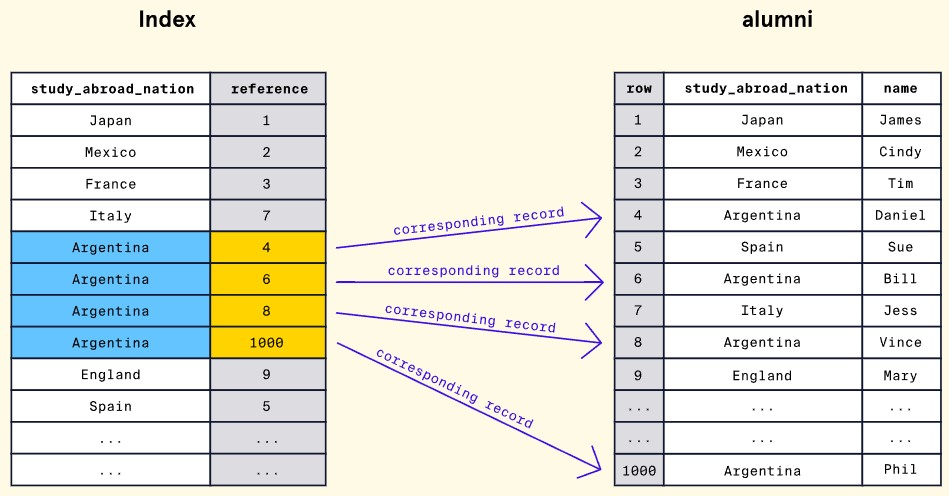

# MongoDB

## Introduction
* MongoDB is a type of document DB (NoSQL)
  * Stores data in documents and collections
  * Can be JSON/BSON/YAML
* E.g. instead of customer data in rows can have a individual documents for each customer
  * Documents stored inside collection
  * Fileds not dependent on one another

## Advantages
* Flexibility/scalability
  * Changing a single document don't impact others
  * Easy scaling up for growth
* Popularity
  * Can be used for web/mobile/desktop apps
  * Large community and resources
* Cloud Tooling
  * MongoDB Atlas is multi-cloud DB service
  * MongoDB realm  helps devs build apps integrated with MongoDB

## MongoDB Data
* Collections/Documents
  * We could have a collection each for purchase, inventory and customer data
    * Within customer collection we could have personal info of a specfic customer in a single document
  * MongoDB database is a few collections assembled together to store data for use case
    * E.g. sports store
  * MongoDB instance can support multiple DBs
* Data as JSON
  * MongoDB calls key:value pairs field:value pairs
  * Gives us readability and flexibility
  * Downsides to storing data as JSON
    * Parsing is inefficient from computational perspective
    * Storage wise also not efficient
    * Supports limited data types i.e. dates not supported
* BSON - MongoDBs Storage Format
  * Stands for Binary Javascript Object Notation
  * Differences to JSON
    * Not human-readable
    * More efficient storage wise
    * Supports extra data formats like dates
  * Data stored as BSON internally but users can create/maninpulate data as JSON
    * Best of both worlds
    * E.g.
```
\x00\x00\x00\x02name\x00\a\x00\x00\x00Rodney\x00\x02occupation\x00\r\x00\x00\x00photographer\x00\x10year_of_experience\x00\a\x00\x00\x00\x00
```

## MongoDB Data Modelling Basics
* **Deciding on structure of data is essentially data modeling**
  * Also entails choosing relationships
  * Will impact scalability, maintainability and performance
* **Importance of Data modelling**
  * Model is like a blueprint for data
  * We might have to choose between data integrity vs performance
* **Modeling relationships in MongoDB**
  * Embedded Documents Vs References
* **Embedded Documents**
  * We nest data related to document inside it
    * Called sub-document
  * Good use cases
    * Relationships where one entity contains another i.e. one-to-one
      * E.g. Relationship between car and license plate
        * A car only has one unqiue licence plate
    * Relationships where we have one entity to many sub-entities i.e. one-to-many
      * E.g. One person owns multiple cars
  * In e.g. below car engine data is nested inside car document
    * A.k.a denormalised data model
    * i.e. when related data lumped into single collection
```
// Car Document
{
  car_id: 48273
  model_name: "Corvette",
  engine: {
    engine_power: 490,
    engine_type: "V8",
    acceleration: "High"
  }
}
```
* **References**
  * Allows us to define relationships by creating links between data
  * We split data into multiple documents
  * When we find related data via link it's essentailly normalised data model
    * Mimics how RDB creates data relationships
  * Use cases
    * Many-to-many relationships
      * E.g. Car rentals and individuals renting cars
        * Car can be rented by multiple individuals and individual can rent multiple cars
  * In e.g. below we have engine data in separate collection buy linked into car collection via **engine_id**
```
//Car Document
{
  car_id: 48273
  model_name: "Corvette",
  engine_id: 2165
}
 
// Engine Document
{
  id: 2165
  engine_power: 490,
  engine_type: "V8",
  acceleration: "High"
}
```
* **Choosing The Right Model**
  * **Example Case A:** A time management application that stores one user per task. We want to store details about the task, such as the task name, the task due date, and the user assigned to the task (and their associated details). There can only be one person assigned to each task. - **Embedded Document - one-to-one**
  * **Example Case B:** A contact information management application that can store multiple addresses per user. The application would store important details for the person such as their name, as well as their associated addresses. - **Embedded document unless we have repitition - one-to-many**
  * **Example Case C:** A school registration application that manages multiple students. Each student can be in multiple classes. Each class record can easily identify which students are registered and each student record can quickly find any associated classes. **References - many-to-many**

### CRUD I: FINDING DOCUMENTS
#### Browsing & Selecting Collections
* We can have multiple DBs on single MongoDB instance
  * E.g. one for ecommerce shop, one for blog app etc.
* `show dbs` command will print a list of all DBs in MongoDB instance
```
test> show dbs
admin        40.00 KiB
config       72.00 KiB # Internal use - We usually don't manually put data in here
local        80.00 KiB # Stores data used in replication process and instance specific-data
restaurants  44.00 KiB
```
* To choose a DB to work utilise the `use` command
```
test> use restaurants
switched to db restaurants
restaurants>
```
* To view all collections use `show collections` command
  * E.g.
```
codecadestream> show collections
channels
users
```
#### Introduction to Querying
* We can use the `.find()` method on a specific collection
  * Cursor returned
    * An object that points to matched documents
  * We are returned results in **batches**
    * Use `it` keyword to see next batch
      * Stands for iterate
  * E.g.
```
restaurants> db.listingsAndReviews.find()
[
  {
    _id: ObjectId("5eb3d668b31de5d588f43081"),
    address: {
      building: '543',
      coord: [ -73.9922175, 40.7543506 ],
      street: '8 Avenue',
      zipcode: '10018'
    },
    borough: 'Manhattan',
    cuisine: 'American',
    grades: [
      {
        date: ISODate("2014-12-29T00:00:00.000Z"),
        grade: 'A',
        score: 7
      },
...
```
#### Querying Collections
* We can pass queries into the `.find()` method
  * As 1st argument
  * Only documents that match criteria are returned
  * Syntax:
```
db.<collection>.find(
  {
    <field>: <value>,
    <second_field>: <value>
    ...
  }
);
```
  * We can pass in as many fields as we like
    * But they are case sensitive
* E.g.
```
db.auto_makers.find({ country: "Japan" });
```
* find() method uses **operator** under the hood
  * By default implicit $eq operator used

#### Querying Embedded Documents
* Sometimes we may have nested documents a.k.a **sub-documents**
* In the example below models field nests data
```
{
  maker: "Honda",
  country: "Japan",
  models: [
    { name: "Accord" },
    { name: "Civic" },
    { name: "Pilot" },
    …
  ]
},
…
```
* We can query nested data using `.find()` method via **dot-notation** to access nested fields
  * Syntax E.g.
```
db.<collection>.find(
  { 
    "<parent_field>.<embedded_field>": <value> 
  }
)
```
* In the example below we query the nested field of zipcode
```
restaurants> db.listingsAndReviews.find({"address.zipcode": "11231"})
```

#### Comparison Operators: $gt and $lt
* gt stands for **greater than**
  * Conversely lt is **less than**
* Syntax example: `db.<collection>.find( { <field>: { $gt: <value> } } )`
* In E.g below we want to find all parks founded after and not including 1900:
```
{
 name: "Yosemite National Park",
 state: "California",
 founded: 1890
},
{
 name: Crater Lake National Park,
 state: "Oregon",
 founded: 1902
},
{
 name: "Mesa Verde National Park",
 state: "Colorado",
 founded: 1906
},
{
 name: "Olympic National Park",
 state: "Washington",
 founded: 1909
},
…
Query: db.national_parks.find({ founded: { $gt: 1900 }});
```
* Alternative is `$gte`
  * Greater than or equal to
* **We can also use lt or gt on strings**
  * E.g. here returns restaurants with first letter of C or lower i.e. A or B `db.listingsAndReviews.find({"address.street": {$lte: "C"}})`

#### Sorting Documents
* We can use the `.sort()` method to sort our results before we return them
  * Argument is document with fields we want to sort on
    * As well as value
      * Specifying 1 or -1
        * 1 for **ascending**
          * For datetime fields this would be chronological order
        * -1 for **descending**
  * Syntax:
```
db.<collection>.find().sort(
  {
    <field>: <value>,
    <second_field>: <value>,
    …
  }
)
```
Example: `db.records.find().sort({ "release_year": 1 });`
```
{
  _id: ObjectId(...),
  artist: "The Beatles",
  album: "Abbey Road",
  release_year: 1969
},
{
  _id: ObjectId(...),
  artist: "Talking Heads",
  album: "Stop Making Sense",
  release_year: 1984
},
{
  _id: ObjectId(...),
  artist: "Prince",
  album: "Purple Rain",
  release_year: 1984
},
{
  _id: ObjectId(...),
  artist: "Tracy Chapman",
  album: "Tracy Chapman",
  release_year: 1988
}
…
```
* In this example the 2nd and 3rd records may be returned in different ordered as the sorted field is duplicated
  * If we ran the query multiples times
* It's also possible to sort on multiple fields
  * Records will be sorted on first field
    * Then any duplicates will be sorted on 2nd field
  * E.g: `db.records.find().sort({ "release_year": 1,  "artist": 1 });`
    * Documents will be sorted 1st by release year and then for each year value they would be sorted on artist
```
{
  _id: ObjectId(...),
  artist: "The Beatles",
  album: "Abbey Road",
  release_year: 1969
},
{
  _id: ObjectId(...),
  artist: "Prince",
  album: "Purple Rain",
  release_year: 1984
},
{
  _id: ObjectId(...),
  artist: "Talking Heads",
  album: "Stop Making Sense",
  release_year: 1984
},
{
  _id: ObjectId(...),
  artist: "Tracy Chapman",
  album: "Tracy Chapman",
  release_year: 1988
}
…
```

* We can also use the `findOne()` method to query a collection for a **single document**
  * E.g below returns single document based on `restaurant_id` field
```
restaurants> db.listingsAndReviews.findOne({restaurant_id: "40564243"})
{
  _id: ObjectId("6474e992b189aac9043893ce"),
  name: 'Elvins',
  cuisine: 'American',
  restaurant_id: '40564243'
}
```
#### Query Projections
* Allows us to return **specfic fields** instead of entire document
  * As we may only need some things
  * Done by passing **second argument** to `.find()` method
  * We give fields a value of 1 or 0
    * 1 means include it
    * 0 means execlude it
* Syntax:
```
db.<collection>.find(
  <query>, 
  { 
    <projection_field_1>: <0 or 1>, 
    <projection_field_2>: <0 or 1>,
    …
  }
)
```
* Example:
```
{
  _id: ObjectId("5eb3d668b31de5d588f4292a"),
  address: {
    building: '2780',
    coord: [ -73.98241999999999, 40.579505 ],
    street: 'Stillwell Avenue',
    zipcode: '11224'
  },
  borough: 'Brooklyn',
  cuisine: 'American',
  grades: [
    { date: ISODate("2014-06-10T00:00:00.000Z"), grade: 'A', score: 5 },
    { date: ISODate("2013-06-05T00:00:00.000Z"), grade: 'A', score: 7 },
    {
      date: ISODate("2012-04-13T00:00:00.000Z"),
      grade: 'A',
      score: 12
    },
    {
      date: ISODate("2011-10-12T00:00:00.000Z"),
      grade: 'A',
      score: 12
    }
  ],
  name: 'Riviera Caterer',
  restaurant_id: '40356018'
}
```
* Query: `db.listingsAndReviews.find( {}, {address: 1, name: 1} )`
* Result: 
```
{
  _id: ObjectId("5eb3d668b31de5d588f4292a"),
  address: {
    building: '2780',
    coord: [ -73.98241999999999, 40.579505 ],
    street: 'Stillwell Avenue',
    zipcode: '11224'
  },
  name: 'Riviera Caterer'
}
```
* The ID field is returned by default but we can turn this off
  * By setting `_id: 0` in projection
    * But can't use inclusion and exclusion at the same time for other fields apart from _id
* We can exclude fields but include all others
  * `db.restaurants.find( {}, {grades: 0} )`


### Other methods
* The `.count()` method returns the number of documents that match a query.
* The `.limit()` method can be chained to the .find() method, we pass in how many documents we want output.
* The `$exists` operator can be included in a query filter to only match documents that contain the given field.
* The `$ne` operator helps check if a field is not equal to a specified value.
* The `$and` and $or operators help perform AND or OR logic operators.
* `.pretty()` method makes query outputs nicer

### CRUD I: Querying on Array Fields
#### Querying for an Entire Array
* We can pass in an array/list to the `.find()` method
  * But the array in the document has to be an **exact match**
    * Arrays with the same elements but different orders and extra elements won't be a match
  * E.g. `db.books.find({ genres: ["young adult", "fantasy", "adventure"] })`
    * Result:
```
{
  _id: ObjectId(...),
  title: "Harry Potter and The Sorcerer's Stone",
  author: "JK Rowling",
  year_published: 1997,
  genres: ["young adult", "fantasy", "adventure"]
},
{
  _id: ObjectId(...),
  title: "The Gilded Ones",
  author: "Namina Forna",
  year_published: 2021,
  genres: ["young adult", "fantasy", "adventure"]
}
```
#### Matching Individual Array Elements
* If we wanted a match on a particular element in that array we can just pass it into `.find()` instead
  * But it will also match other elements too
* E.g. `db.books.find({ genres: "young adult" })`
  * Result
```
{
  _id: ObjectId(...),
  title: "Children of Blood and Bone",
  author: "Tomi Adeyemi",
  year_published: 2018,
  genres: ["fantasy", "young adult", "adventure"]
},
{
  _id: ObjectId(...),
  title: "The Hunger Games",
  author: "Suzanne Collins",
  year_published: 2008,
  genres: ["young adult", "dystopian", "science fiction"]
},
{
  _id: ObjectId(...),
  title: "The Black Flamingo",
  author: "Dean Atta",
  year_published: 2019,
  genres: ["young adult", "coming of age", "LGBTQ"]
},
…
```
#### Matching Multiple Array Elements with $all
* We can use the `$all` operator to match on multiple elements in array
  * Ignores order or other elements
  * Essentially matches arrays which contain elements in **any order**
* E.g. `db.books.find({ genres: { $all: [ "science fiction", "adventure" ] } })`
  * Result:
```
{
  _id: ObjectId(...),
  title: "Jurassic Park",
  author: "Michael Crichton",
  year_published: 1990,
  genres: ["science fiction", "adventure", "fantasy", "thriller"]
},
{
  _id: ObjectId(...),
  title: "A Wrinkle in Time",
  author: "Madeleine L'Engle",
  year_published: 1962,
  genres: ["young adult", "fantasy", "science fiction", "adventure"]
},
{
  _id: ObjectId(...),
  title: "Dune",
  author: "Frank Herbert",
  year_published: 1965,
  genres: ["science fiction", "fantasy", "adventure"]
},
…
```
#### Querying on Compound Filter Conditions
* We could also use **comparison operators** to match documents where elements in array meet condition  
  * Or multiple conditions
* E.g. We want to search collection for players who have been singles champion year 2000 onwards
  * Query:  `db.tennis_players.find({ wimbledon_singles_wins: { $gte: 2000 } });`
  * Result:
```
{
  _id: ObjectId(...),
  name: "Serena Williams",
  country: "United States",
  wimbledon_singles_wins: [2002, 2003, 2009, 2010, 2012, 2015, 2016]
},
{
  _id: ObjectId(...),
  name: "Venus Williams",
  country: "United States",
  wimbledon_singles_wins: [2000, 2001, 2005, 2007, 2008]
},
{
  _id: ObjectId(...),
  name: "Roger Federer",
  country: "Switzerland",
  wimbledon_singles_wins: [2003, 2004, 2005, 2006, 2007, 2009, 2012, 2017]
},
```
* Similarly we could have multiple conditions
  * Acts as an **or**
  * E.g. find all atletes who won the singles after 1971 or before 1935
  * Query: `db.tennis_players.find({ wimbledon_singles_wins: { $gt: 1971, $lt: 1935 } })`
  * Result:
```
{
  _id: ObjectId(...),
  name: "Suzanna Lenglen",
  country: "United States",
  wimbledon_singles_wins: [1919, 1920, 1921, 1922, 1923, 1925]
},
{
  _id: ObjectId(...),
  name: "Roger Federer",
  country: "Switzerland",
  wimbledon_singles_wins: [2003, 2004, 2005, 2006, 2007, 2009, 2012, 2017]
},
…
```
#### Querying for all Conditions with $elemMatch
* Allows us to specfiy multiple conditions for an array's element that we want to match on for
  * Acts as **and**
  * At least one element in array needs to match **all conditions**
* E.g. below matches on players who won singles between 2000 and 2019
  * Query: `db.tennis_players.find({ wimbledon_singles_wins: { $elemMatch: { $gte: 2000, $lt: 2020 } } })`
  * Result:
```
{
  _id: ObjectId(...),
  name: "Pete Sampras",
  country: "United States",
  wimbledon_singles_wins: [1993, 1994, 1995, 1997, 1998, 1999, 2000]
},
{
  _id: ObjectId(...),
  name: "Serena Williams",
  country: "United States",
  wimbledon_singles_wins: [2002, 2003, 2009, 2010, 2012, 2015, 2016]
},
{
  _id: ObjectId(...),
  name: "Roger Federer",
  country: "Switzerland",
  wimbledon_singles_wins: [2003, 2004, 2005, 2006, 2007, 2009, 2012, 2017]
}
```
* Example 2: Find no. of channels which have at least 1 follower in followers array that have is_subscribed value set to true
```
db.channels.find({followers: {$elemMatch: { is_subscribed: true}}}).count()
55
```

#### Querying an Array of Embedded Documents
* We can also query emdedded documents
  * i.e. dictionaries within other dictionaries
* E.g. below we query tennis_platers collection for 2nd place players in 2019 - Fields have to be in this **exact order** in doc
  * Query: `db.tennis_players.find( { "wimbledon_doubles_placements": { year: 2019, place: 2 } } )`
  * Result
```
{
  _id: ObjectId(...),
  name: "Gabriela Dabrowski",
  country: "Canada",
  wimbledon_doubles_placements: 
  [{ 
    year: 2019,
    place: 2
  }]
},
{
  _id: ObjectId(...),
  name: "Yifan Xu",
  country: “China”,
  wimbledon_doubles_placements: 
  [{ 
    year: 2019,
    place: 2
  }]
}…
```
* This query can match a single field: `db.tennis_players.find( { "wimbledon_doubles_placements.year": 2016 } )`


### CRUD II: Inserting & Updating
#### The _id Field
* MongoDB uses it to identify each unique document
* Usually looks like this `_id: ObjectId("5eb3d668b31de5d588f4305b")`
  * Type is ObjectId
    * 12-byte data type
    * Also contains embedded timestamp when generated automatically
      * Allows documents ro bw **inserted** in order of creation
* id field characteristics
  * **Required** for all documents and must be **unique**
  * MongoDB auto generates field if we don't provide it
  * If we wanted to specify it ourselves we can make it a **string** or **int**
    * Instead of `ObjectId` field
* Field is **immutable**
  * i.e. it can't be updated or changed


#### Inserting a Single Document
* We can use the `.insertOne()` method to add a **new document** to our collection
  * One mandatory parameter and one optional which is `writeConcern`
    * Latter allows us to say how we want write requests ack'd
* Syntax:
```
db.<collection>.insertOne(
  <new_document>, 
  {
    writeConcern: <document>,
  }
);
```
* Example:
```
db.videogames.insertOne({
  title: "Elden Ring",
  year: 2022,
  company: "Fromsoftware"
});
```
* Result:
  * `acknowledged` is related to `writeConcern` parameter
  * `insertedId` returns the ID of the object
```
{
  "acknowledged": true,
  "insertedId": ObjectId("5fd989674e6b9ceb8665c63d")
}
```
* If we try to insert into a collection that **doesn't exist** MongoDB will create one then do it


#### Inserting Multiple Documents
* We can use the `insertMany()` method to insert more than one document at once
  * 3 parameters
    * Array of documents
    * `writeconcrn`
    * `ordered`: default is True
      * Should it insert in same format as we pass in or unordered i.e. we don't care about order
      * If set to True - single document insert failure means all fail
        * When False i.e. unordered insert, an insertion failure of one doesn't affect other documents in array
* Syntax:
```
db.<collection>.insertMany(
  [<document1>, <document2>, ...],
  {
    writeConcern: <document>,
    ordered: <boolean>
  }
);
```
* Example
```
db.students.insertMany([
  {
    name: "Mia Ramirez",
    age: 15
  },
  {
    name: "Kiv Huang",
    age: 17
  },
  {
    name: "Sam Soto",
    age: 16
  }
], { ordered: true })
```
* Output:
```
{
  acknowledged: true,
  insertedIds: {
    '0': ObjectId("63054a5376742c0e5a0cfafb"), // Mia
    '1': ObjectId("63054a5376742c0e5a0cfafc"), // Kiv
    '2': ObjectId("63054a5376742c0e5a0cfafd") // Sam
  }
}
```
#### Updating a Single Document
* We can use the `updateOne()` method to update a single document
  * It finds the **first** document that matches the filter creiteria
  * **Only updates first matching document even if multiple match**
  * Parameters
    * `filter`: Document with selection criteria
    * `update`: Document with any modifications to apply
      * i.e. modify existing fields, insert new fields or replace entire document
    * `options`: Document with any other extras
      * E.g. `writeConcern` or `upsert`
* Syntax:
```
db.<collection>.updateOne(<filter>, <update>, <options>)
```
* Example below is of a collection called products which holds iPhone inventory info
```
{ 
  _id: ObjectId("507f1fg7bcf865d799439h11"), 
  title: "iPhoneX", 
  price: 1000,
  stock: 25 
},
{ 
  _id: ObjectId("507f1fg7bcf865d799439h12"), 
  title: "iPhone7", 
  price: 600,
  stock: 25 
},
{ 
  _id: ObjectId("507f1fg7bcf865d799439h13"), 
  title: "iPhone6", 
  price: 500,
  stock: 25 
}
```
* Our update command will need to specify **which fields** we want to update and **how**
  * Latter done via **update operators**
  * E.g. below uses `$set` operator to **replace** a fields value
    * Filter is `title` field
  * Command: `db.products.updateOne({ title: "iPhoneX" }, { $set: { price: 679 } });`
  * Result: `{ "acknowledged" : true, "matchedCount" : 1, "modifiedCount" : 1 }`

#### Updates on Embedded Documents
* Also possible to make changes to embedded documents i.e. field inside dictionary
  * Example below shows document in collection called `furniture`
```
{
  _id: ObjectId("3ldh1fg733kf65d7994393ld"),
  name: "bedframe",
  dimensions: {
    length: 75,
    width: 38
  }
}
```
  * To update width field we can use below command
```
db.furniture.updateOne(
  { name: "bedframe" },
  { $set: { "dimensions.width": 54 }}
);
```
* Similarly if we had an array we wanted to update we can use dot notation but specify **array index** instead
```
{
  _id: ObjectId("402h1fg73cf865d799439k42"),
  team: "Chicago Bulls",
  championships: [1991, 1902, 1993, 1996, 1997, 1998]
}
```
  * Our command to update the 2nd item in the list championships i.e. change 1902 to 1992
```
db.nbateams.updateOne(
  { team: "Chicago Bulls" }, 
  { $set: {"championships.1": 1992 }}
)
```
#### Updating an Array with New Elements
* We could use `$push` operator to append elements to end of array
  * Used along with `updateOne()` method
* Syntax:
```
db.<collection>.updateOne(
  <filter>,
  { $push: { <field1>: <value1>, ... } }
);
```
* Example below shows collection called automobiles with document as below
```
{
  _id: ObjectId("627934bbfd6a8619040cc287"),
  make: "Audi",
  model: "A1",
  year: [2017, 2019]
}
```
* We push new element to **year array** via below command
```
db.vehicles.updateOne(
  { make: "Audi" },
  { $push: { year: 2020 }}
);
```
* Updated document now looks like this:
```
{
  _id: ObjectId("627934bbfd6a8619040cc287"),
  make: "Audi",
  model: "A1",
  year: [2017, 2019, 2020]
}
```
* If we use $push on a field that **doesn't exist** it will add that field to document
#### Upserting a Document
* Upsert allows us to **combine** updating and inserting of data into a collection
  * **Optional** parameter for methods like `.updateOne()`
    * Accepts boolean
      * Set to False by default
    * If True it will **update** data if there is matchingdocument
    * Else it will insert **new document**
* Syntax:
```
db.<collection>.updateOne(
  <filter>, 
  <update>, 
  { upsert: <boolean> }
);
```
* Example below uses collection namd pets with documents having the below structure
```
{
  _id: ObjectId(...),
  name: "Luna",
  type: "Cat",
  age: 2
}
```
* Upsert useful in a scenario when we want to capture age but we're unsure if document already exists
* Command below searches for Cat with Name Luna, if it finds it then updates age otherwise creates creates new document with specified details
```
db.pets.updateOne(
  { name: "Luna", type: "Cat"},
  { $set: { age: 3 }},
  { upsert: true }
)
```
#### Updating Multiple Documents
* We can use `updateMany()` method to update **all documents** which match condition
  * Works in similar way to `updateOne()`
* Syntax:
  * Filter - Selection criteria
  * Update - Modifications we want to apply
  * Options - Other options like upsert
```
db.<collection>.updateMany(
  <filter>, 
  <update>, 
  <options>
);
```
* Example below updates all employees with salary of $75000 to $80000
  * Document looks like the below
```
{
  _id: ObjectId(...),
  name: "Rose Nyland",
  department: "Information Technology",
  salary: 75000
},
{
  _id: ObjectId(...),
  name: "Dorothy Zbornak",
  department: "Human Resources",
  salary: 75000
},
{
  _id: ObjectId(...),
  name: "Sophia Petrillo",
  department: "Human Resources",
  salary: 75000
},
{
  _id: ObjectId(...),
  name: "Blanche Devereaux",
  department: "Sales",
  salary: 80000
}
```
  * Set new salary for those on 75k only
```
db.employees.updateMany(
  { salary: 75000 },
  { $set: { salary: 80000 }}
)
```

#### Modifying Documents
* We can use the `findAndmodify()` method to **update and return** a document we've just modified
  * Single document returned
    * By default **doesn't** include modifications made
* Syntax
```
db.<collection>.findAndModify({
  query: <document>,
  update: <document>,
  new: <boolean>,
  upsert: <boolean>,
  ...
});
```
* Arguments
  * query - Selection criteria
  * update - Document with fields and changes we want to make to them
  * new - Returns modified document when set to **True**
    * False by default
  * Upsert - Create new document if query fails to match document
  * Also supports other options
    * ordered - if set to **false** it will insert documents in unordered format
      * Increased performance
    * 
* Example below has foodTrucks collection
```
{
  _id: ObjectId(...),
  name: "Criff Dogs",
  address: "15 Bedford Ave",
  shutdown: false
},
{
  _id: ObjectId(...),
  name: "Sals Pizza",
  address: "249 Otter Place",
  shutdown: false
}
```
  * This example will return the document **before modification**
```
db.foodTrucks.findAndModify({
  query:  { name: "Criff Dogs" },
  update: { shutdown: true }
});
```
  * Output
```
{
  _id: ObjectId(...),
  name: "Criff Dogs",
  address: "15 Bedford Ave",
  shutdown: false
}
```
* Another example below shows how we can use **upsert** option
```
db.foodTrucks.findAndModify({
  query:  { name: "Ben and Jerry", address: "17 Cliff Pl" },
  update: { shutdown: false },
  new: true,
  upsert: true
});
```
* `.findAndModify()` is very similar to `.updateOne()` but latter doesn't return new document

#### Review
* Extras
  * We can use `$unset` with `.updateOne()` or `.updateMany()` methods to **remove field** from document
  * `.findOneAndUpdate()` method is similar to `updateOne()`
    * But returns original or updated doc instead
  * Possible to update **name of collection** without modifying documents
    * Done via `.renameCollection()`
  * We can do **multiple write operations** using `.bulkwrite()` method
    * Updating or inserting

### CRUD II: Deleting Documents
#### Deleting a Document
* There are different ways to delete documents from a collection
* One of these is the `.deleteOne()` method
  * Syntax: `db.<collection>.deleteOne(<filter>, <options>);`
    * Arguments:
      * filter - Document with selection criteria
      * options - Document with **optional fields**
        * E.g. `writeConcern`
* Example below uses this document called `monsters`
```
{
  _id: ObjectId(...),
  name: "Luca",
  age: 100,
  type: "Hydra"
},
{
  _id: ObjectId(...),
  name: "Lola",
  age: 95,
  type: "Hydra"
},
{
  _id: ObjectId(...),
  name: "Igor",
  age: 95,
  type: "Chimera"
},
```
* In this example we delete a single monster with age 95
  * `db.monsters.deleteOne({ age: 95 });`
* The output is as below
  * `{ acknowledged: true, deletedCount: 1 }`
* **This method only deletes one document**
  * If we have multiple with same name which one may depend on order of insertion or indexing etc.

#### Deleting Multiple Documents
* The `.deleteMany()` method removes **all** documents given a specific filter
  * Syntax: `db.<collection>.deleteMany(<filter>, <options>);`
  * Arguments
    * filter - document with selection criteria
    * options - Document with optional fields
        * E.g. `writeConcern`
* **If we forgot to provide filter then ALL documents from collection will be deleted**
* Example below uses same monsters collection as before
  * Delete all monsters that have tpye as hydra
  * `db.monsters.deleteMany({ type: "Hydra" });`
  * Output:
    * `{ acknowledged: true, deletedCount: 3 }`

#### Replacing a Document
* Sometimes we might want to delete a document and then immediately **replace** it with another one
  * `.replaceOne()` method allows us to do this
    * Means we don't need to do separate delete and insert method calls
  * This method replaces **first matched document** inside collection
  * Syntax
```
db.<collection>.replaceOne(
  <filter>, 
  <replacement>, 
  <options>
);
```
  * Arguments
    * filter - document with selection criteria
    * replacement - new document which will replace current one
      * Can be subset of original document
        * i.e. doesn't need all fields
    * options - Document with optional fields
        * E.g. `upsert`
* In the example below we have `employees` collection
  * Rohit Kohli leaves company but we still want to keep his name but not his title
    * We want to remove the other fields
```
{
  _id: ObjectId(...),
  name: "Rohit Kohli",
  department: "Customer Analytics"
  position: "Senior Software Engineer"
},
{
  _id: ObjectId(...),
  name: "Rin Paterson",
  department: "People Operations",
  position: "Head of People Operations"
}
```
  * New inserted document only has name and changes position to N/A
```
db.employees.replaceOne(
  { name: "Rhoit Kohli" }, 
  { name: "Rohit Kohli", position: "N/A" }
);
```
  * Output: 
```
{
  acknowledged: true,
  insertedId: null,
  matchedCount: 1,
  modifiedCount: 1,
  upsertedCount: 0
}
```
* Difference between this method and `.updateOne()` are that latter only updates specific fields
  * Not entire document
* Again `.replaceOne()` only replaces the 1st matched document
  * Not all

#### Extras
* `.findOneAndReplace()` method is similar to `.replaceOne()` but it returns the original/new document
* `.findOneAndDelete()` method deletes and returns the deleted document

### Indexing in MongoDB Article
#### What is Indexing
* Prevents us having to search entire DB to find our result
* Helps queries be more efficient
* Index is **special data structure**
  * Stores portion of a collections data in easy to search format
* Similar to index in a book
  * E.g. instead of reading book cover to cover to find all instances of Japan
    * Just go to index at the back where it tells us page numbers
* **Queries that don't use indexes have to parse each doucment in collection to find matches**
  * Ok for small collections but otherwise bad for performance

#### Types of Indexes in MongoDB
* **Single-field index** - Reference one-field of document
  * E.g. School teacher wants to find all people who studied abroad in Argentina
    * One option is to run query on all alumni who studied in argentina
      * Better option is to create single-field index on field exclusive to these people
      * Captures subset of alumni data

* Example:

  * Teacher can then use this index to query spercific countries
      * Query more efficient as subset of data is scanned as opposed to all
      * Also faster as infexes **arrange** data in ascending/descending order
* **Compound Index** - An index on multiple fields
  * E.g. If we wanted to organise alumni based on **where** and **when** student was abroad
  * Indexes being ordered helps sort subset of students chronologically
    * Helps efficiency of range-based query operations
* **Multi-key index**
  * Support optimised queries on **array fields**
    * Each element in array in indexed
  * Automatically created when we create index on field with array
  * Compariable with 2 other indexes 

#### Tradeoffs
* Indexes mostly beneficial when selective queries ysed
  * i.e. result set is small portion of data in collection
* Indexes improve query performance but write performance suffers
  * As each index consumes space
  * Each time we do insert/remove/update on collection index needs to be updated
    * Thus operation is **slower**
* Generally using indexes advantage is optimising queries
  * Improves compute, bandwidth and time efficiency


### Introduction to Indexing

#### Single Field Index
* MongoDB creates default index on `_id` field for all documents
* We can use the `.createIndex()` method to create **custom index**
* Syntax: `db.<collection>.createIndex({ <keys>, <options>, <commitQuorum>)}`
  * arguments: 
    * keys: Document with *field* & *value* **pairs**
      * field is index key
      * value is type of index
    * options: Document with optional params
    * commitQuoroum: Gives control over replica sets
* For keys parameter fields can be assigned value of `1` or `-1`
  * 1 - sort index in **ascending** order
  * -1 - sort index **descending** order
* Example below uses colleciton called students
```
{ 
  _id: ObjectId(...),
  last_name: "Tapia",
  first_name: "Joseph",
  major: "architecture",
  birth_year: 1988,
  graduation_year: 2012,
  year_abroad: 2011
}
```
  * Rather than querying entire collection by `year_abroad` field to find students who were abroad in a year create index
    * Single field index on this field via this command: `db.students.createIndex({ year_abroad: 1 });`
      * Creates index on all documents in students collection on `year_abroad` field in ascending order
  * We can now use `.find()` on new index to find students who studied abroad after 2019
    * E.g. `db.students.find({ year_abroad: { $gt: 2019 }});`
    * Saves query execution time as only index with ordered `year_abroad` field scanned instead of entire collection


#### Performance Insights with .explain()
* Indexing in MongoDB tied to DB performance
* `.explain()` method allows us to see how much indexes imapct performance
* Syntax: `db.<collection>.find(...).explain(<verbose>)`
  * parameters:
    * verbose - One of three: queryPlanner/ExecutionStats/allPlansExecution
* Example uses same students collection as above: 
 *  Query: `db.students.find({ year_abroad: { $gt: 2019 }}).explain('executionStats');`
 * Truncated output of `.explain()` method might looks like below BEFORE index creation
 ```
 executionStats: {
  executionSuccess: true,
  nReturned: 1336,
  executionTimeMillis: 140,
  totalKeysExamined: 0,
  totalDocsExamined: 5555,
  executionStages: {
    …
  }
}
 ```
 * After index creation
 ```
 executionStats: {
  executionSuccess: true,
  nReturned: 1336,
  executionTimeMillis: 107,
  totalKeysExamined: 1336,
  totalDocsExamined: 1336,
  executionStages: {
   …
  }
}
 ```
  * We can see that before index 5555 documents were examined
    * But only 1336 after
  * Plus query after index creation was **33ms faster**
    * Would be even greater time saving with bigger collection
 * **Good to try this before and after index creation to see difference**


#### Compound Indexes
* Compund indexes reference **multiple fields** in document
  * Multiple-field queries also supported
* Syntax: 
```
db.<collection>.createIndex({ 
  <field>: <type>, 
  <field2>: <type>, 
  …
})
```
* Order of fields is important with compound indexes
* Example is for students collection and we want to find students who studied abroad in **particular country** and **year**
  * Index creation: 
```
db.students.createIndex({ 
  study_abroad_nation: 1, 
  year_abroad: -1 
});
```
  * Becuase we specify `stidy_abroad_nation` first it's sorted on this field 1st
    * Then each nation will have the `year_abroad` field sorted in reverse order
    * E.g.
```
Argentina 2011
Argentina 2019
Brazil 2015
```
  * Anytime we query above 2 fields MongoDB will **automatically** use index
    * Below is e.g. of query
```
db.students.find({ 
  study_abroad_nation: "Brazil", 
  year_abroad: 2012 
});
```
* Compund indexes also supports queries on a **beginning subset** of the indexed fields
  E.g.
```flint supercharger
db.students.createIndex({ 
  study_abroad_nation: 1, 
  year_abroad: -1, 
  graduation_year: 1 
});
```
  * Above supports queries on following fields
    * `study_abroad_nation`
    * `study_abroad_nation` and `year abroad`
    * `study_abroad_nation` and `year abroad` and `graduation_year`
  * But not on these fields due to the order
    * `year_abroad`
    * `graduation_year`
    * `year_abroad` and `graduation_year`
* Consider a compound index as it could be **more efficient** compared to multiple single-field indexes
  * As **each index** has to be **updated** as **document changes**
  * Too many indexes can hurt DB write speed

#### Multikey Index on Single Fields
* Used for indexes on array fields
  * Automatically done by MongoDB
  * Index key for each elemnt provided
* Example below is from `students` collect with `sports` field that is array
```
{ 
  _id: ObjectId(...),
  last_name: "Tapia",
  first_name: "Joseph",
  major: "architecture",
  birth_year: 1988,
  graduation_year: 2012 ,
  sports: ["rowing", "boxing"]
}
```
  * We create index on field in ascending order: `db.students.createIndex({ sports : 1 });`
    * Values sorted in alphabetical order
    * Index contains **individual references** to **each element** in array

#### Multikey Index on Compound Fields
* Only possible where **one field** is an array
* In example below we have students collection
```
{ 
  _id: ObjectId(...),
  last_name: "Tapia",
  first_name: "Joseph",
  major: "architecture",
  birth_year: 1988,
  graduation_year: 2012 ,
  sports: ["rowing", "boxing"],
  clubs: [“Honor Society”, “Student Government”, “Yearbook Committee”]
}
```
  * Not possible to create index on BOTH `sports` and `clubs` fields
    * We'd have to create **two separate** indexes
    * But index with either one of these and another field is possible
* Below is 2 examples of compound multikey index
```
db.students.createIndex({ sports: 1, major: 1 });
db.students.createIndex({ clubs: -1, graduation_year: -1 });
```

#### Deleting Index


#### Additional Operators
* `$size` operator matches any array with no. of elements we specify
* `$in` operator matches documents where we pass in array that contains elements in specified array
* `$nin` operator is essentially opposite of above. in order words `not in`

### Operations
* **Comparison operators on Array fields**
  * `.find()` method can query a collection with comparison operators
  * E.g. below finds document in `ufc_contestants` collections where array field: 2008 > `championship_years` > 2004
```
db.ufc_contestants.find({
  championship_years: { $gt: 2004, $lt: 2008 }
})
```
* **Query projections with .find()**
  * It's possible to limit amount of data returned or return only data that has specific field
    * E.g. below only returns name and location field of documents in restaurants collection with `grade` field
```
db.restaurants.find( { grade: "A" }, { name: 1, location: 1 } )
```
* **Connection to DB**
  * We can navigate to a DB via mongo shell using `mongosh` command
  * In e.g. below we select existing DB called dailychecks
    * `use dailychecks`
  
* **Sort method**
  * `.sort()` method can be appended to queries to order documents
    * 1 used for ascending order
    * -1 for descending order
    * Won't work for fields with duplicate values across documents
    * E.g. below views list of documents in `documentaries` collection sorted in descending order on `release_year` field
```
db.documentaries.find().sort({ release_year: -1 })
```

  

